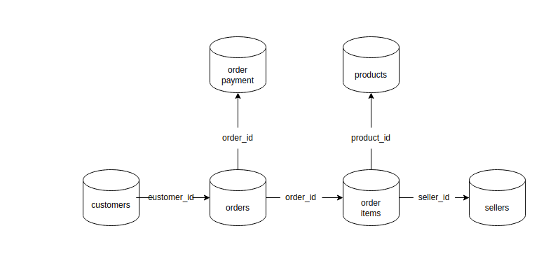

# Desafio de Analytics Engineer
## Considerações sobre o desafio
* O prazo padrão para entrega da solução é de 7 dias corridos, contados a partir da data de recebimento do desafio. Caso você precise de mais tempo, entre em contato conosco e fechamos uma nova data para a entrega. Não se preocupe, somos super flexíveis ;)
- Não se preocupe em responder todos os pontos do desafio. Queremos ver até que ponto você consegue se aprofundar :)
 
## Case Study
### Contexto Geral
Nós, da empresa **Tupi Livre**, somos um marketplace, ou seja, temos como objetivo conectar consumidores e vendedores em todo território Tupiniquins. Atualmente na nossa plataforma possui desde itens eletrônicos, esporte e lazer até ferramentas de jardinagem. Nos últimos 3 meses a empresa vem crescendo exponencialmente a uma taxa maior do que 150% ao mês e com isso existem diversos projetos e iniciativas nascendo por toda a companhia.

E você é o novo integrante do time de Dados da empresa e como primeiro desafio foi convocado pelo líder do time de Analytics para ajudar a coletar dados da empresa para a construção de importantes tabelas para suportar os relatórios solicitados pelos times internos.

##### Data Stack

Na **Tupi Livre** organizamos a nossa [estrutura de dados](https://www.trifacta.com/blog/data-stack/) seguindo o conceito de [Modern Data Stack](https://towardsdatascience.com/the-building-blocks-of-a-modern-data-platform-92e46061165) e nesse [link](https://towardsdatascience.com/the-beginners-guide-to-the-modern-data-stack-d1c54bd1793e) você consegue mais informações sobre. Desse modo separamos o nosso pipeline em basicamente em duas etapas:

* **Ingestão**
Nessa etapa garantimos que todas as fontes de dados estão sendo inseridas no nosso Banco de Dados (BigQuery) no formato Raw Data, ou seja, no formato mais cru possível sem nenhuma transformação. Nessa camada os dados podem estar duplicados, não formatados e até desorganizados. 

* **Transformação**
Já nessa etapa ocorre as transformações, ou seja, agrupamentos, aplicações de regras de negócio e normatizações. Desse modo, conseguimos obter dados documentados, curados e prontos para os times de negócio utilizá-los com maior facilidade e segurança em suas análises/decisões de negócio. 

Com isso em mente, construimos a nossa estrutura, segue o desenho: 

### Desafio

##### Projeto: Placar do Cliente
Com o crescimento exponencial da nossa empresa, o time de CRM, responsável pelas comunicações de relação com o cliente, resolveu realizar um estudo para entender melhor cada cliente na nossa plataforma e assim conseguir se posicionar melhor nas nossas comunicações. Para isso o time de CRM solicitou a seguinte tabela a ser construída pelo time de dados:

##### *customer_metrics*
   - **customer_id**: Esse é o id do customer da tabela customers, usamos para identificar cada usuário.
   - **customer_city**: Cidade do nosso cliente.
   - **customer_state**: Estado do nosso cliente.
   - **recency**: Recência é definida da diferença de dias da última compra do cliente com a data atual. Ex: Hoje é dia 2021-12-10 e o cliente fez o seu último pedido no dia 2021-12-01, portanto recência é 9 (dias). 
   - **frequency**: Frequência é definida como a quantidade total de pedidos entregues do cliente.
   - **monetary_value**: Monetary Value é definido como a soma total do preço e frete de todos os pedidos entregues do cliente.
   - **qty_items_delivered**: Soma total de todos os itens que foram entregues ao cliente. 
   - **basket_size**: Divisão entre  qty_items_delivered/frequency, como resultado é quantidade média de itens por pedido.

##### Projeto: A melhor experiência
Com o aumento das vendas, uma preocupação da liderança é manter a qualidade dos nossos sellers. Assim, o time responsável pela experiência do cliente (CX) solicitou uma tabela para realizarem um estudo como podemos identificar novas oportunidades nesse quesito. Para isso, temos que construir a seguinte tabela:

##### *sellers_metrics*
   - **seller_id**: Esse é o id do seller da tabela sellers, usamos para identificar cada seller.
   - **seller_city**: Cidade do nosso seller.
   - **sellerr_state**: Estado do nosso seller.
   - **qty_orders_delivered**:  Quantidade total de pedidos entregues.
   - **qty_items_delivered**:  Quantidade total de itens entregues.
   - **basket_size**: Divisão entre  qty_items_delivered/qty_orders_delivered, como resultado é quantidade média de itens por pedido.
   -  **qty_orders_ontime**:  Quantidade total de pedidos entregues dentro do prazo estabelecido.
   -  **avg_delivery_late_days**: Tempo médio de dias de atraso, somente considerando as orders atrasadas.
   -  **avg_delivery_ontime_days**: Tempo médio de quanto tempo demora uma entrega, somente considerar as orders ontime.

##### O que você deve entregar no final? 
Como entrega do case você deverá fornecer os seguintes arquivos:

* Arquivo .sql que irá gerar a tabela customer_metrics.
* Arquivo .sql que irá gerar a tabela sellers_metrics.
* Uma apresentação tipo slides (PowerPoint, Google Presentation, etc) no seguinte formato:

  - Breve apresentação pessoal: Formação, um pouco de sua experiência e hobbies/fun-facts (~5 min).
  - Análises dos dados, quais checks você fez e um pouco de como pensou o desenvolvimento (~20 min).
  - Perguntas e dúvidas para o nosso time. (~10min)

Os dados estão disponíveis no BigQuery no projeto [data-case-study-322621](https://console.cloud.google.com/bigquery?project=data-case-study-322621). Iremos criar um usuário para você realizar consultas no próprio BigQuery via interface, esse usuário será criado com o email fornecido por você.
Para facilitar o entendimento das tabelas raw do dataset estamos disponibilizando as relações entre elas e as chaves. Atenção, como os dados são raw podem haver inconsistências nos dados.

